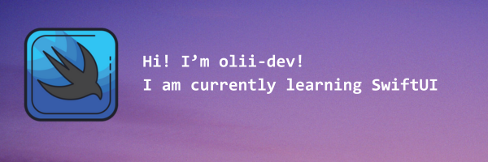

### Hey There 

I’m @olii-dev
- 👀 I’m interested in Coding **(obviously)**, Technology, Gaming and other things.
- 🌱 I’m currently learning SwiftUI
- 📫 How to reach me? Through my email
- 😄 Pronouns: He/Him
- ⚡ Fun fact: I like apples 🍎 and Apple 
---
**Visitor Count on my profile:**

---
# This is what I am learning right now:

---

# My stats

<!---
olii-dev/olii-dev is a ✨ special ✨ repository because its `README.md` (this file) appears on your GitHub profile.
You can click the Preview link to take a look at your changes.
--->
