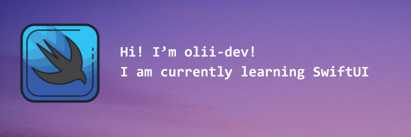

  
  
  
  # Oli Mebberson
  **Frontend Developer & Technology Enthusiast**
  
  
  

## About Me

I'm a passionate frontend developer who enjoys building engaging web experiences and exploring emerging technologies. My approach combines creative problem-solving with technical precision to deliver impactful digital solutions.

**Current Focus:**
- 🚀 Developing **[quip](https://olii-dev.github.io/quip/)** - A GUI interface for OpenRouter providing free AI chat capabilities
- 📚 Expanding expertise in mobile development with Swift and iOS technologies  
- 🌐 Exploring modern deployment platforms and cloud technologies
- 💡 Contributing to open-source projects and the developer community

**Professional Interests:**
- Frontend architecture and user experience design
- Modern JavaScript frameworks and development tools
- Cross-platform development solutions
- AI integration in web applications

📧 **Contact:** [oli@mebberson.com](mailto:oli@mebberson.com)  
🌐 **Portfolio:** [oli-mebberson.is-cool.dev](https://oli-mebberson.is-cool.dev)

 

## Featured Projects

### 🤖 [Quip](https://olii-dev.github.io/quip/)
A modern GUI interface for OpenRouter that provides free access to AI chat capabilities. Built with a focus on user experience and accessibility, Quip demonstrates my ability to integrate cutting-edge AI technologies with intuitive frontend design.

**Key Features:**
- Clean, responsive user interface
- Free AI chat functionality through OpenRouter integration
- Modern web technologies implementation

## Technical Expertise

### Core Technologies

  
  
  
  
  

### Development Tools & Platforms

  
  
  
  
  
  
  

### Currently Learning

  
  
  
  

### Development Environment

  
  
  
  
  

## Connect With Me

  
  

## GitHub Analytics

  

  

  

### Achievements

  

  

---

  
**Thank you for visiting my profile!** 

Feel free to explore my repositories and don't hesitate to reach out for collaboration opportunities or technical discussions.
  
⭐️ *Consider starring repositories that interest you* ⭐️
  

<!---
olii-dev/olii-dev is a ✨ special ✨ repository because its `README.md` (this file) appears on your GitHub profile.
You can click the Preview link to take a look at your changes.
--->
